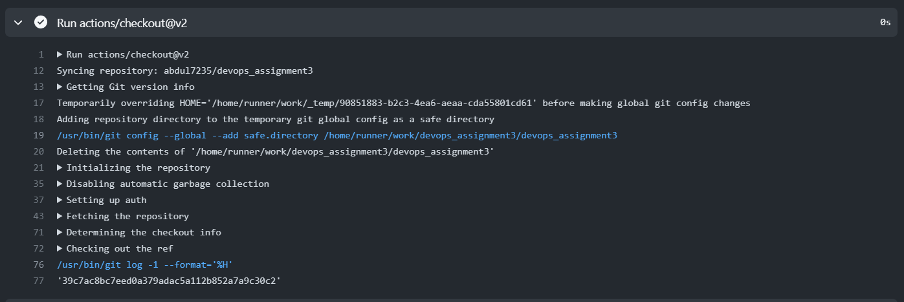
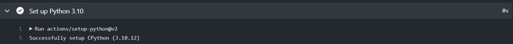
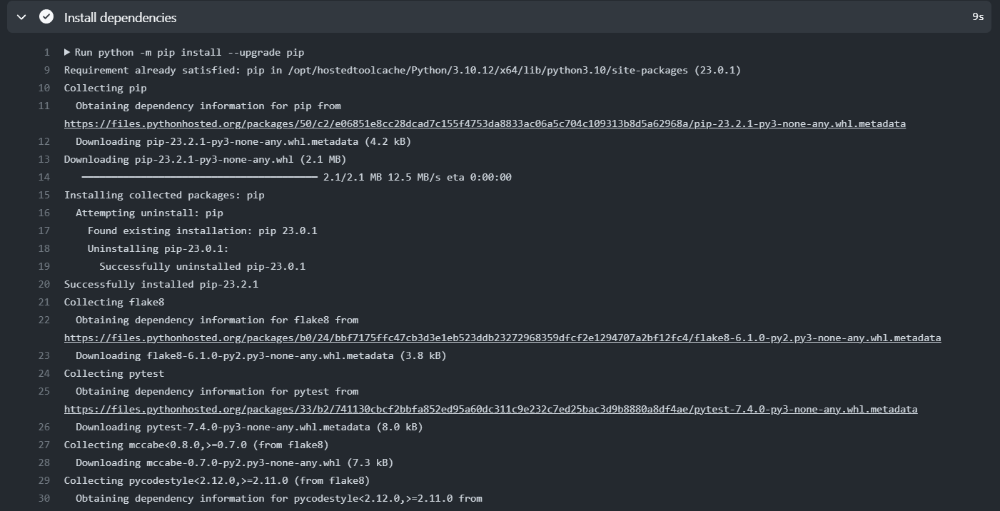
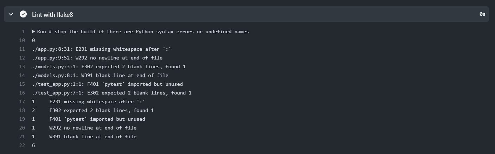
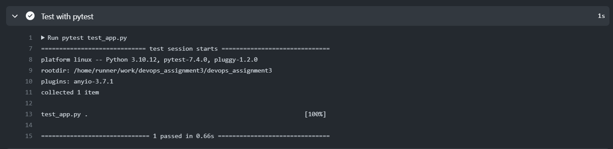
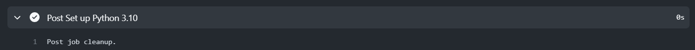
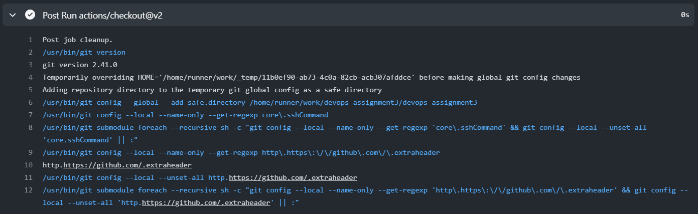
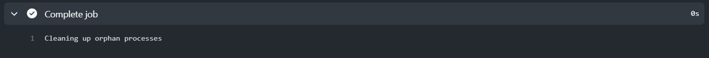

**devops_assignment3**

**My github workflow file is in .github/workflows file**

I took a standard python application workflow form the marketplace

The workflow runs on ubuntu's latest image and on python 3.10 enviornment

Installs dependencies

Lint with flake

test with pytest

